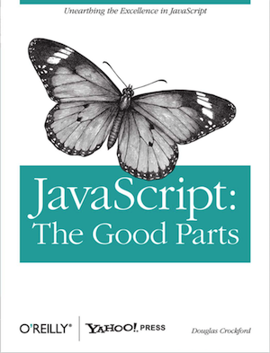

# the-good-parts-awesome

##Motivation
 
Every time when you start to learn a programming language, guys who know about the language or who don't know a shit but try to look like they know suggest you a lecture and article or a book. Well when I started to learn Javascript I heard many times did you read The Good Parts - Douglas Crockford ?? And I said every time: NO, I didn't read it!! But finally I decided to read this amazing book!
Now I want to make a summary of the things that I really keep with me after reading this awesome book.

For the ones that don't know (and are in the same situations I was before)...  this is the book I'm talking:
   
 

 
 
##Chapters
1. Good Parts
2. Grammar 
3. Objects 
4. Functions 
5. Inheritance
6. Arrays
7. Regular Expressions
8. Methods 
9. Style 
10. Beautiful Features

 
##Summary
###1. Good Parts
I can't sum up this part, just read the awesome introduction of Douglas Crockford.
###2. Grammar 
###3. Objects 
1. An object in Javascript is a container of properties. 
2. A property is defined by a name and a value.
* A property name can be any string, including the empty string.
* A property value can be any JavaScript value except for undefined.
 
Every Objects are linked to a prototype object from where they can inherit properties
		
###4. Functions 
####Scope
JavaScript does have function scope. That means that the parameters and variables defined in a function are not visible outside of the function, and that a variable defined anywhere within a function is visible everywhere within the function.
####Closure
Inner functions get access to the parameters and variables of the functions they are defined within only with the exception of "this" and arguments.
###5. Inheritance
###6. Arrays
As we know arrays are linear allocation on memory which each elements are accessed by intergers that allow you to compute offset but... 
In Javacript arrays are not the same as in another language. In Javascript arrays are objects that has some array-like characteristics, this make arrays significantly slower than a real array.
###7. Regular Expressions
Take care with two lines, in a JavaScript program, the regular expression must be on a single line!
###8. Methods 
####Arrays
#####Don't confuse splice with slice
There are two differents methods. From Douglas Crockford: 

#####array.slice(start, end) 
The slice method makes a shallow copy of a portion of an array. The first element copied will be array[start]. It will stop before copying array[end]. The end parameter is optional, and the default is array.length.
 
#####array.splice(start, deleteCount, item...)
The splice method removes elements from an array, replacing them with new items. The start parameter is the number of a position within the array. 
The deleteCount parameter is the number of elements to delete starting from that position. If there are additional parameters, those items will be inserted at the position. It returns an array containing the deleted elements.
#####Sorting Arrays
Sorting numbers with array.sort() didn't works as we expect.  
If you have this array: 
var n = [4, 8, 15, 16, 23, 42];  
and use n.sort();  
you are going to get: 
// n is [15, 16, 23, 4, 42, 8]  
JavaScript’s default comparison function assumes that the elements to be sorted are strings. 
So take care of this! You have to create you own function to order numbers, in the book Douglas Crockford suggest one solution.
#####Shift
The shift method removes the first element from an array and returns it. 
Avoid using shift, is slower that pop. In the book Douglas suggest us to implemented in this way:  
Array.method('shift', function () { return this.splice(0, 1)[0];});

####Strings
#####Concat
var s = 'C'.concat('a', 't'); // s is 'Cat' 
Concat a string with this method is the same as concating with + operator in this way: 
var s = 'C' + 'a' + 't'; 

This last one is more clearly to read than the concat.

#####toLocaleLowerCase() and toLocaleUpperCase() are nice methods
Some months ago I worked on a turkish project and in some place we have to put all the text in uppercase, as I didn't know about the existence of this method I used the normal string.toUpperCase(), but we loose the real character. If you use toLocaleUpperCase() language ‘i’ converts to ‘&#x130;’, not ‘I’ same with the inverted convertion.

###9. Style 
###10. Beautiful Features
Also I don't want to sum up this part, please take a look on the conclusions of Douglas Crockford.

 
##Personals Conclusions
 
##Feel free to contribute so we can create a real awesome summary :)
